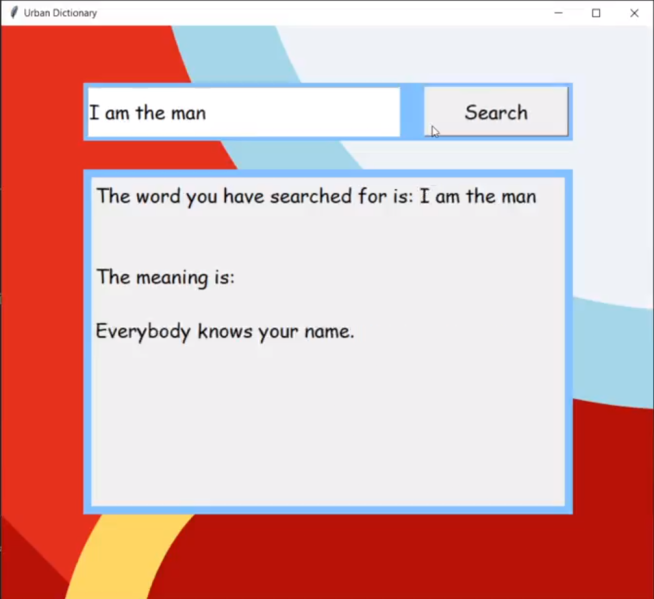
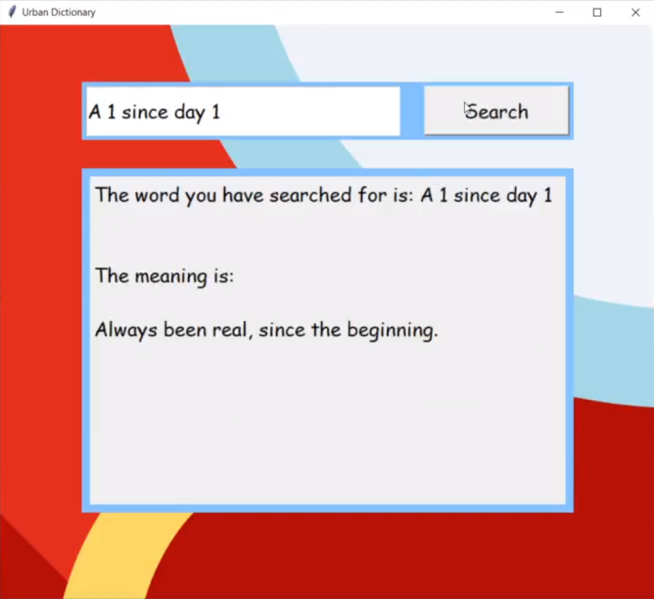

# UrbanDictionary
The following mini-project was made with the initial idea of solving the problems that the boomer generation experiences. 
The problem is the usually find themselves in a situation where they are unable to understand the words used by the newer generations and the modern lingo in general.
Since the usage of social media is increasing even in these older generations, they have to keep up with the modern words.
Hence, this Urban Dictionary Desktop App acts as barrier to enrich them with the urban words by getting the meaning with a single click.

## Screenshots

Here is how it works:
https://www.linkedin.com/posts/hrigved-khatavkar-1a5b33165_hey-guys-this-is-a-desktop-application-ugcPost-6764177443482804224-H47f
